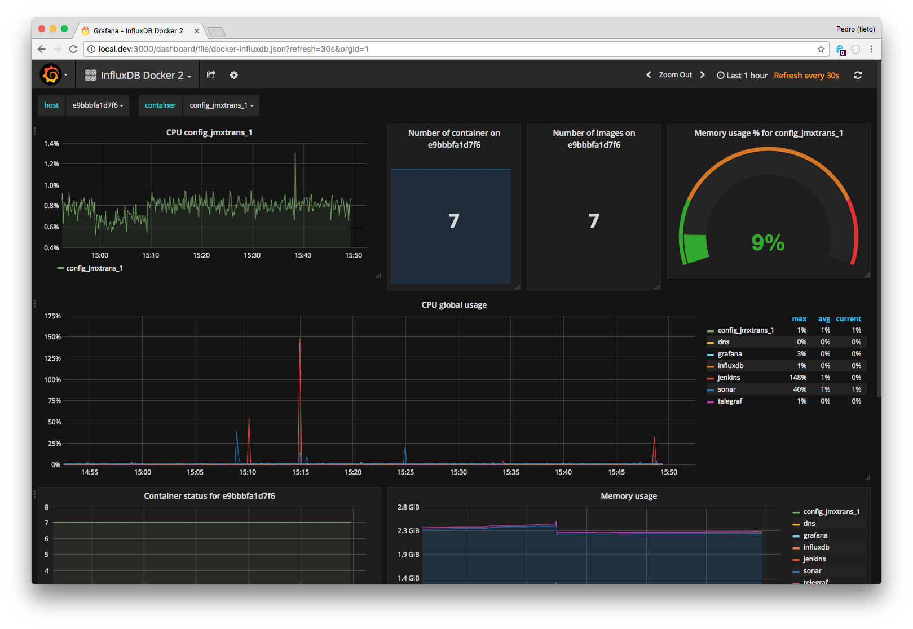
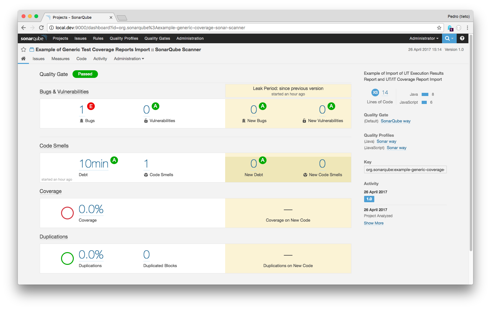

# devops-docker

This Vagrant box is intented for testing of services.

There are few stacks available as docker-compose files. You can check inside the ````config```` folder and read also inside the ````provision```` folder. 

The default stack is a jenkins, sonarqube, influxdb, grafana stack. Is intented for testing locally jenkins pipelines and how to interconnect services such sonarqube in order to visualize code issues in grafana (through influxdb).

The repo itself contain a valid jenkinsfile that you can use to create your pipeline (also to get inspired).

Fork this repo and use it to experiment locally. 

Any feedback is welcome!





## Services

- [DevUi](http://local.dev)
- [Grafana :3000](http://local.dev:3000)
- [Influxdb :8083](http://local.dev:8083)
- Telegraf
- [Jenkins :8080](http://local.dev:8080)
- [Sonar :9000](http://local.dev:9000)
- Registrator
- [Consul :8500](http://local.dev:8500)
- [elasticsearch :9200](http://local.dev:9200)

## DevUi

Unified UI where you can see all the services. Sometimes you start to accumulate so many services that you need during your development time. Like GitHub, Jenkins, Sonar, Grafana... 

DevUi comes as a simple entry point where you can switch from one to another. Is nothing than a simple HTML page that loads the services within an ```ìframe````.


## Requirements 

- Vagrant
- Virtualbox

### Vagrant plugins

All the services are exposed in the domain ````local.dev```` with the hostupdater plugin we will have it set up in our host machine.

```
vagrant plugin install vagrant-hostsupdater
```

We will use docker for all the services and with this plugin we can get it install quite easily.

```
vagrant plugin install vagrant-docker-compose
```

## Configuration of containers

### Jenkins

In order to get the token to start the setup please follow this steps:

SSH into the vagrant machine ````vagrant ssh````

Then:

````
docker exec -it jenkins bash
cat /var/jenkins_home/secrets/initialAdminPassword
````

Jenkins will require some manual configuration such us connection to ````github.com````, declare and configure the sonar local server (local.dev:9000) and so on. 

#### Jenkinsfile

This repo includes a ````jenkinsfile```` with the idea of testing the pipelines and the sonar-influxdb-grafana integration

#### Jenkins plugins

- Influxdb
- SonarQube Scanner for Jenkins	
- BlueOcean (new pipelines interface)

#### Jenkins InfluxDB plugin installation (manual)

In order to get jenkins metrics (about build status) pushed to influx you have to install the influxdb jenkins plugin. Unfortunatelly it has a dependency issue with another plugin (performance).
You can track the open issue [here](https://issues.jenkins-ci.org/browse/JENKINS-43539?page=com.atlassian.jira.plugin.system.issuetabpanels%3Achangehistory-tabpanel)

In order to avoid this conflic you must install manually first the performance plugin (available in the ````config/jenkins/plugins```` folder as performance.hpi) and then the influxdb plugin (also available in same path).

Information about the pluging [here](https://wiki.jenkins-ci.org/display/JENKINS/InfluxDB+Plugin)

### Grafana

This grafana set up adds a data source from a local influxdb container and add some ready made dashboards. You can see the creation of the data source in ````provision/20_add_grafana_datasource.sh```` and the premade dashboards in ````config/grafana/dashboards````. 

### Sonar

Sonar will be use here with an example code. You can find the project [here](https://github.com/SonarSource/sonar-examples)

The ````properties```` file is on the root path of this repository and is thought with the idea of the dummy that lives on the ````helloworld```` folder.


-------

Pedro Diaz - 2017